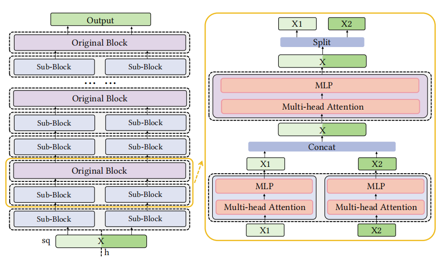

# DeTransformer
This is the computational artifact of the paper [*Communication-Efficient Model Parallelism for Distributed In-situ Transformer Inference*](https://ieeexplore.ieee.org/abstract/document/10546617) accepted by DATE 2024.


## Overview
DeTransformer is a system designed for distributed Transformer inference, with the primary focus on minimizing communication overheads. 

DeTransformer adopts the concept of "co-design", which refers to the collaboration of the algorithm-side optimization and system-side optimization. 

For the algorithm-side optimization, DeTransformer decouples the model structure by restructuring the original Transformer layer with a single block to the decoupled layer with multiple sub-blocks, thereby exposing inter-block parallelism and posing more opportunities for system-side optimization. 

For the system-side optimization, DeTransformer employs the adaptive execution approach incorporating with the static planning and the runtime planning, benefiting from the inter-block parallelism brought by the algorithm-side optimization.

By adopting the idea of "co-design", DeTransformer can significantly reduce the communication demands and maximize the performance benefits during distributed inference.

<br><div id="top" align="center">

</div><br>


## Accuracy Experiment
As DeTransformer adopts decoupled Transformer structure, we perform the accuracy experiment to study the impacts of structure decoupling on model accuracy across a range of downstream tasks.
Firstly, we pre-train both the original Bert and the decoupled Bert models using th identical hyper-parameters, and then we employ 4 tasks of GLUE benchmark and SQuAD v1.1 task as downstream tasks to validate the model quality.

The codes of the accuracy experiment are modified on top of [NVIDIA/DeepLearningExamples](https://github.com/NVIDIA/DeepLearningExamples/blob/master/PyTorch/LanguageModeling/BERT/README.md), and we keep the same parameters in the example code. 
The code in `accuracy_experiment/modeling_split.py` showns the process of decoupling.

## Performance Experiment
We perform the performance experiment to study the distributed inference performance of DeTransformer under a variety of network bandwidth.


### Hardware
In this paper, we conduct distributed inference on a multi-ARM platform with  Raspberry Pi 4B as edge devices, each of which consists of a ARM-CortexA72 Soc operating at 1.5GHz and 4 GB memory. 
Devices are connected via a gigabyte H3C S1850V2 switch, providing an interface to adjust the D2D bandwidth so that we can evaluate the performance under different network conditions. 


### Test
```bash
# running with TP
torchrun --nproc_per_node=4 main_megatron.py
# running with BP (DeTransformer)
torchrun --nproc_per_node=4 main_bert.py --num_debert_blocks 4 --num_division 4
```

Note that the settings of `num_debert_blocks` and `num_division` need to be consist of those in pre-training.
